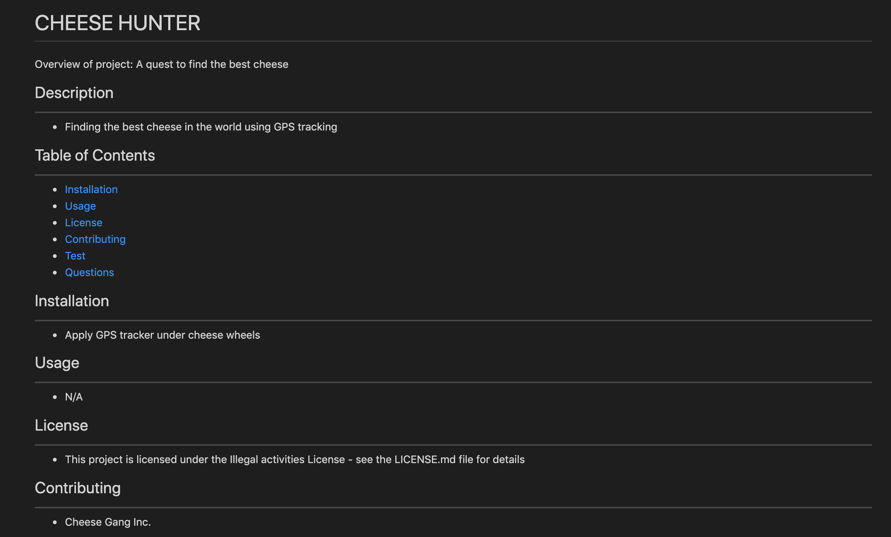

# README-Generator

This project uses node.js to generate a readme template that can be filled out with user information from prompted questions.

## How to use

***

[Click Me](https://drive.google.com/file/d/1PvILxmEJ7xkonG6n7nxlNHaN8OfrscEQ/view?usp=sharing) to see how the readme generator functions.

## Visuals

***

The following screenshot is of a readme template that was made using the readme generator.

